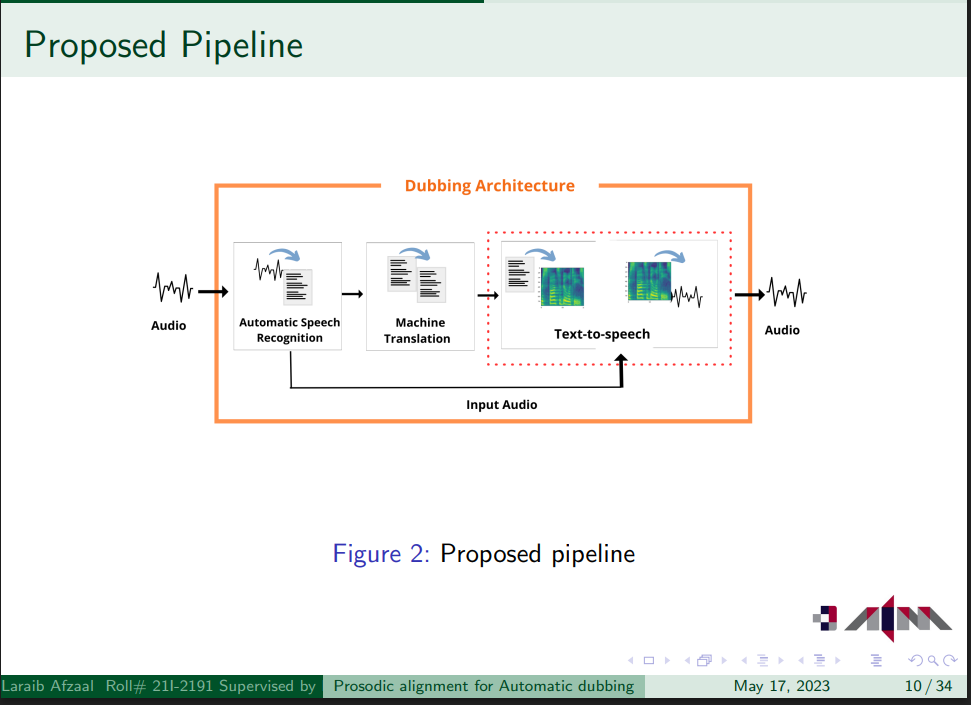

# Prosodic Alignment for Automatic Dubbing

**Author:** Laraib Afzaal  
**Supervisor:** Dr. Mirza Omer Beg  
**Institution:** National University of Computer and Emerging Sciences (FAST NUCES)

## 🧠 Overview

This project aims to improve the audiovisual coherence of automatic dubbing systems by aligning suprasegmental features (intonation, stress, and rhythm) of source and target speech. By incorporating prosodic-aware features in the TTS synthesis pipeline, we enhance the naturalness and temporal alignment of generated speech.

## 🎯 Objective

To develop a speech synthesis model that:
- Matches the prosody of the original speaker.
- Achieves low **WER** and **MCD-DTW** scores.
- Outperforms standard TTS baselines in audio-visual dubbing scenarios.

## 🔍 Research Highlights

- **Text-to-Speech (TTS) Systems:** Whisper, Coqui TTS, NeMo, Silero
- **Evaluation Metrics:** 
  - Word Error Rate (WER)
  - Mel Cepstral Distortion with Dynamic Time Warping (MCD-DTW)
- **Dataset:** Mozilla Common Voice (English, Delta Segment 12.0)

## 📌 Proposed Pipeline

 <!-- Add your image here if available -->

## 🧪 Results

| Model      | WER (%) | MCD (DTW) |
|------------|---------|------------|
| Coqui TTS  | XX.X    | X.XX       |
| NeMo TTS   | XX.X    | X.XX       |
| **Proposed** | **XX.X** | **X.XX** |

## 🧰 Tools and Technologies

- Python, PyTorch
- Whisper by OpenAI
- Hugging Face Transformers
- Common Voice Dataset
- Librosa, NumPy, Matplotlib
- Colab for prototyping

## 📁 Files

- `notebooks/` – Colab notebooks with experiments
- `results/` – Sample audio outputs and plots
- `docs/` – Slides and project documentation
- `src/` – Code (if converted from notebook)

## 📜 References

- Neural Dubber: [NeurIPS 2021]
- YourTTS: [ICML 2022]
- Improvements to Prosodic Alignment: [ICASSP 2021]

## 🙌 Acknowledgments

Special thanks to my supervisor **Dr. Mirza Omer Beg** and the FAST NUCES faculty for their guidance and support.
